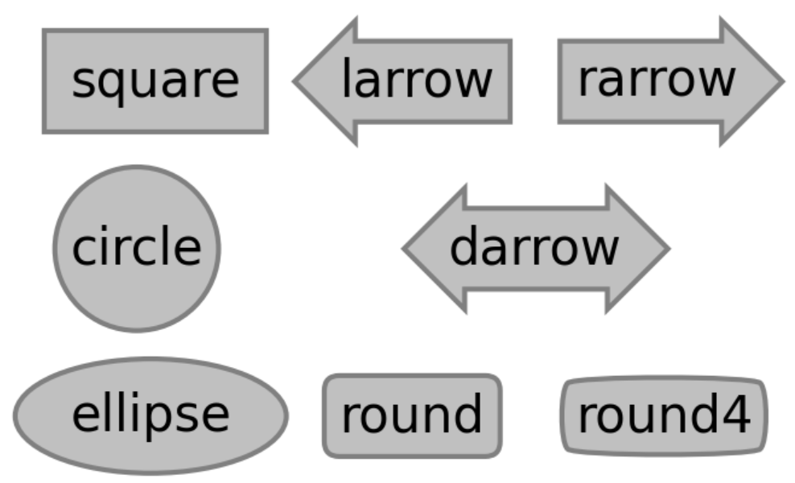
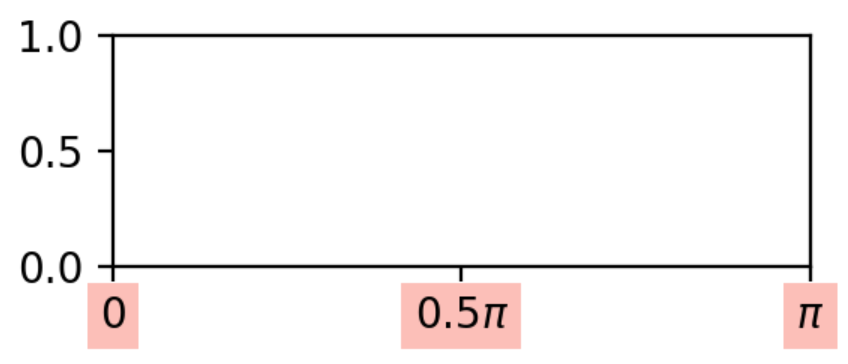
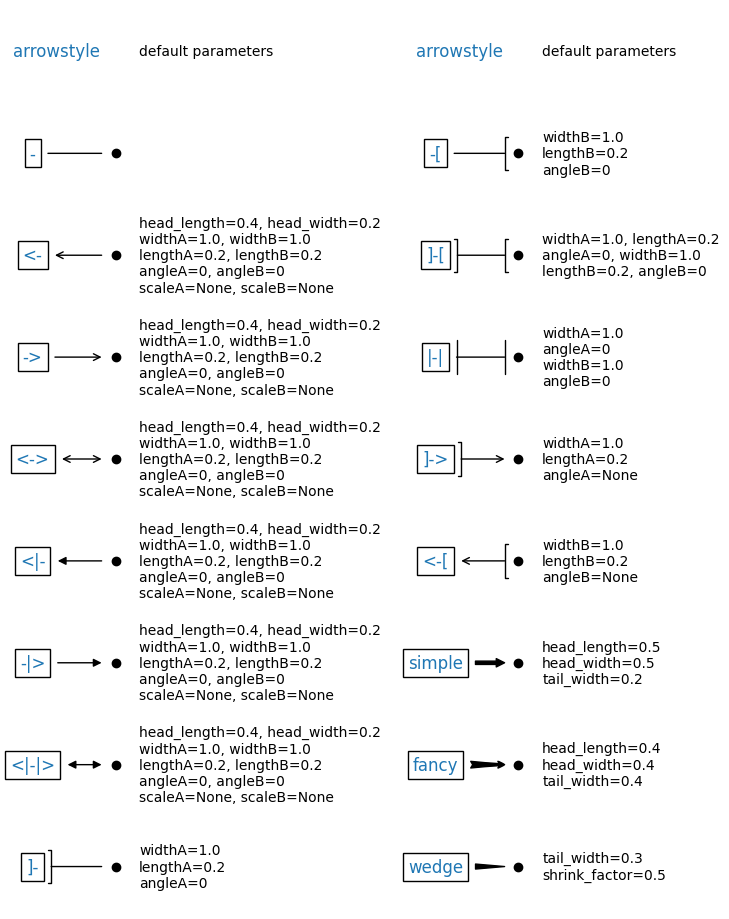

<h2 class="collapsible" onclick="toggleContent(this)"> Marker </h2>

In method like `plot` or `scatter`,
the marker can be set by `marker="marker name"`.
The marker size can be set by `markersize=<16>`.

[Click here to document for Marker](https://matplotlib.org/stable/api/markers_api.html)

There is a list of marker symbols in the table below.

| marker | symbol                                   | description    |
| ------ | ---------------------------------------- | -------------- |
| "."    |           | point          |
| ","    |           | pixel          |
| "o"    |          | circle         |
| "v"    |   | triangle_down  |
| "^"    |     | triangle_up    |
| "<"    |   | triangle_left  |
| ">"    |  | triangle_right |
| "1"    |        | tri_down       |
| "2"    |          | tri_up         |
| "3"    |        | tri_left       |
| "4"    |       | tri_right      |
| "8"    |         | octagon        |
| "s"    |          | square         |
| "p"    |        | pentagon       |
| "P"    |    | plus(filled)   |
| "\*"   |            | star           |
| "h"    |        | hexagon1       |
| "H"    |        | hexagon2       |
| "+"    |            | plus           |
| "x"    |               | x              |
| "X"    |       | x(filled)      |
| "D"    |         | diamond        |
| "d"    |    | thin_diamond   |
| "\|"   |           | vline          |
| "\_"   |           | hline          |

<h2 class="collapsible" onclick="toggleContent(this)"> Colors </h2>

[Click here to document for Colors](https://matplotlib.org/stable/gallery/color/named_colors.html)

The control parameter for color is `color="color name"`.
There are many forms of `color name`, including:

1. Single letter

2. Word

3. Six-digit hexadecimal color value

- "#ff0094"
- "#ff0000"
- "#000000"

<h2 class="collapsible" onclick="toggleContent(this)"> Colormap </h2>

[Click here to document for Colormap](https://matplotlib.org/stable/gallery/color/colormap_reference.html)

The control parameter for color mapping is `cmap="colormap name"`.
Commonly used `colormap names` are:

- `jet`: The default option for `ANSYS Fluent`.
- `coolwarm`: The default option for `Paraview`.
- `hot`: The default option for `Comsol`.
- `Greys` or `gray`: Grayscale.
- `binary`: Black and white binary.
- All `colormap names` support `colormapname_r` to reverse.

<h2 class="collapsible" onclick="toggleContent(this)"> Line Styles </h2>

The line style parameter can be set by `linestyle="linestyle name"`. 
The line width is controlled by `linewidth=<2>` or `lw=<2>`. 
Commonly used `linestyle names` are:

- `solid`: Solid line.
- `dotted`: Dotted line.
- `dashed`: Dashed line.
- `dashdot`: Dash-dot line.

The line style can also be controlled by a tuple `(a, (b, c,...))`, where:

- `a`: The repetition mode of the line, usually 0.
- `b`: The length of the line segment.
- `c`: The length of the blank space.
- `d`: The length of the next line segment (optional).
- `e`: The length of the next blank space (optional).

Here are some effects, for more infomation [Click here to document for linestyles](https://matplotlib.org/stable/gallery/lines_bars_and_markers/linestyles.html)

<h2 class="collapsible" onclick="toggleContent(this)"> Hatch </h2>

The `hatch` parameter can be used to specify the fill value of a `patch` object in some plotting functions. This is often used in some [bar charts](https://matplotlib.org/stable/gallery/shapes_and_collections/hatch_demo.html) to distinguish different groups of data. [Click here to document for hatch](https://matplotlib.org/stable/gallery/shapes_and_collections/hatch_style_reference.html)

Here are some possible values for the `hatch` parameter:

1. A single character determines the style.

2. Repeating characters can increase the density.

3. Combining characters can combine styles.

<h2 class="collapsible" onclick="toggleContent(this)"> Box Style </h2>

[Click here to document for BoxStyle](https://matplotlib.org/stable/api/_as_gen/matplotlib.patches.BoxStyle.html)

1. The code below demonstrates the method of specifying text boxes in the `Axes.text` function, as shown in the figure below.

<pre>
fig, ax = plt.subplots(figsize=(3,2), dpi=300)

ax.text(0.1, 0.8, "square", bbox=dict(boxstyle='square', fc='silver', ec='gray', pad=0.5))
ax.text(0.1, 0.5, "circle", bbox=dict(boxstyle='circle', fc='silver', ec='gray'))
ax.text(0.1, 0.2, "ellipse", bbox=dict(boxstyle='ellipse', fc='silver', ec='gray'))

ax.text(0.42, 0.8, "larrow", bbox=dict(boxstyle='larrow', fc='silver', ec='gray'))
ax.text(0.7, 0.8, "rarrow", bbox=dict(boxstyle='rarrow', fc='silver', ec='gray'))
ax.text(0.55, 0.5, "darrow", bbox=dict(boxstyle='darrow', fc='silver', ec='gray'))

ax.text(0.42, 0.2, "round", bbox=dict(boxstyle='round', fc='silver', ec='gray'))
ax.text(0.7, 0.2, "round4", bbox=dict(boxstyle='round4', fc='silver', ec='gray'))
</pre>

2. For text objects created without adding text boxes, user can use the set_bbox method to add them, for example

<pre>
fig, ax = plt.subplots(figsize=(3,1), dpi=200)

xticks = ax.set_xticks([0,1.57,3.14],[0,r'0.5$\pi$', r'$\pi$'])

for text in ax.get_xticklabels():
    text.set_bbox(dict(facecolor='salmon', pad=3, alpha=0.5))
    text.get_bbox_patch().set_edgecolor('none')
</pre>

3. The Linestyle, Linewidth, and Color of the text box can be set after obtaining the text box object by using the `get_bbox_patch()` function, and using the set_color, set_edgecolor, and set_linestyle functions to determine.

<h2 class="collapsible" onclick="toggleContent(this)"> Arrow Style </h2>

[Click here to document for ArrowStyle](https://matplotlib.org/stable/api/_as_gen/matplotlib.patches.ArrowStyle.html)

ArrowStyle usually used in annotate, and the default parameters can be modified as follows:

<pre>
from matplotlib.patches import ArrowStyle
ax.annotate("->", xytext=(0.1,0.25), xy=(0.9,0.25),
    arrowprops=dict(
        arrowstyle=ArrowStyle('->', head_length=.4, head_width=.4), 
        connectionstyle="arc3,rad=-0.0",
        color="k", shrinkA=5, shrinkB=5,
    ), bbox=dict(boxstyle="square", fc="w"))
</pre>

The Arrowstyle and its keyword are shown below, and the meaning of keyword is shown in the table below.

| keyword            | meaning                              |
| ------------------ | ------------------------------------ |
| `head_length`      | Length of arrow head                 |
| `head_width`       | Width of arrow head                  |
| `widthA, widthB`   | Width of arrow head at start and end |
| `lengthA, lengthB` | Width of arrow cap at start and end  |
| `angleA, angleB`   | Angle of arrow cap at start and end  |
| `tail_width`       | Width of arrow tail                  |
| `shrink_factor`    | Factor of wedge bulging, usually 0.5 |

<h2 class="collapsible" onclick="toggleContent(this)"> Style Sheets </h2>

You can use `plt.style.use('bmh')` to set the corresponding style. The style string name can be printed by using `print(plt.style.available)`. After installing some libraries (such as `pip install SciencePlots`), more styles can be used. [Click here to document for Style Sheets](https://matplotlib.org/stable/gallery/style_sheets/style_sheets_reference.html)。

Here are some built-in styles.

